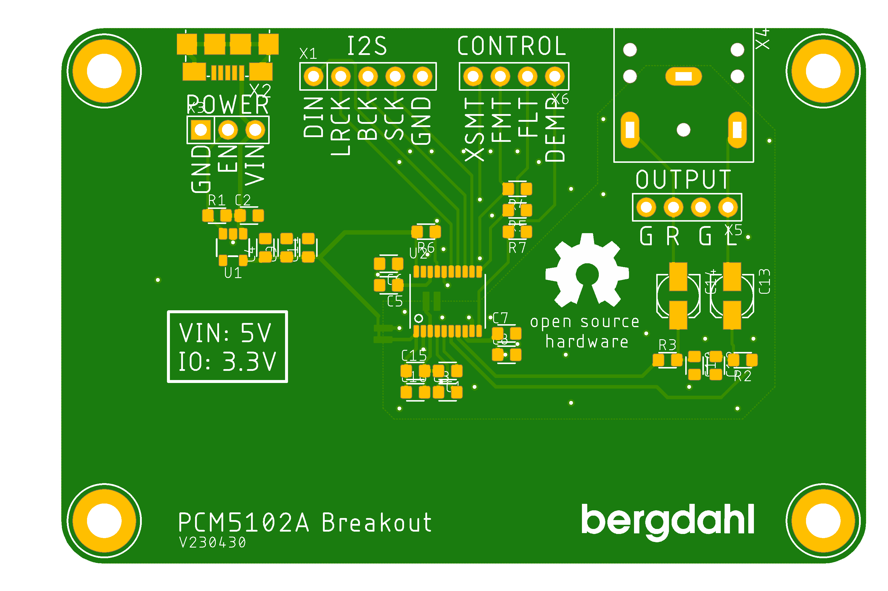

# Audio_PCM5102A_Breakout

This is a breakout board for the Texas Instrument PCM5102A chip. It is a I2S Audio Stereo DAC.

According to the manufacturer:

>The PCM510xA devices are a family of monolithic
CMOS-integrated circuits that include a stereo digital-to-analog converter and additional support circuitry in
a small TSSOP package.

## I2S Pins

Name | Description
---- | ----
DIN | Audio iata in
LRCK | Audio data word clock input
BCK | Audio data bit clock input
SCK | System clock inout
GND | Digital ground

## Control pins
Name | Description
---- | ----
XSMT | Soft mute control
FMT | Audio format selection
FLT | Filter select
DEMP | De-amphasis control for 44.1-kHz sampling rate

## Power
Name | Description
---- | ----
VIN | 5V power, regulated sown to 3.3V with on board LDO
EN | Enable power, 1 = On, has pullup resistor on board
GND | Ground
